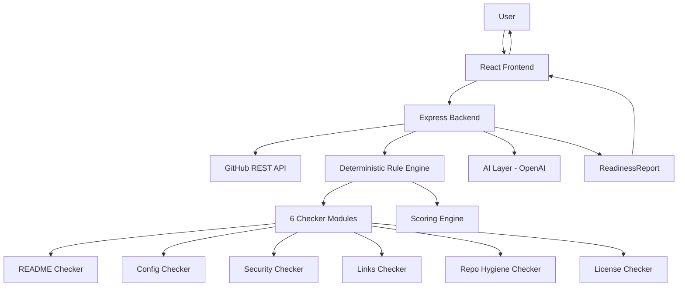

# ShipCheck AI 🚀

> Your final reviewer before you hit Submit.

ShipCheck AI is an automated pre-submission repository agent that inspects a public GitHub repository, verifies important submission-readiness signals, identifies problems with evidence, prioritizes what needs fixing, and generates an actionable final checklist.

## What it checks

---

## Problem

Hackathon builders spend most of their time building features and often discover repository problems only minutes before submission:

- Incomplete README
- Missing setup instructions
- Undocumented environment variables
- Broken demo links
- Missing `.gitignore`
- Configuration problems
- Missing build/test information
- Potentially exposed secrets
- Poor repository structure

Manual checking is repetitive, time-consuming, and easy to miss. ShipCheck turns this last-minute manual checklist into one automated workflow.

---

## Solution

ShipCheck AI provides a single, excellent workflow:

```
Paste GitHub Repository
        ↓
Validate Repository
        ↓
Inspect Repository
        ↓
Run Deterministic Checks
        ↓
Collect Evidence
        ↓
Prioritize Findings
        ↓
AI Explains Findings
        ↓
Generate Fix Plan
        ↓
Re-scan Repository
        ↓
Show Improved Readiness
```

The product is optimized for the question: "If I submit this repository right now, what important things might I have missed?"

---

## Features

### Core Analysis Engine

- **Repository Health Checks** — Verifies repository exists, is public, has README, LICENSE, .gitignore, source structure, and clear project identity
- **README Analysis** — Detects project overview, problem statement, features, tech stack, installation, environment variables, usage, demo URL, screenshots, and architecture documentation
- **Configuration Analysis** — Detects project stack (React, Next.js, Node.js, Python, Django, FastAPI, Java, Spring, etc.) and runs relevant checks
- **Security Pattern Detection** — Scans for API keys, access tokens, passwords, private key markers, and secret environment files (values are redacted)
- **Link Checking** — Validates URLs, detects placeholders, checks for localhost URLs, verifies demo links where safe
- **Build & Test Readiness** — Detects test scripts, test configuration, build scripts, testing documentation, and CI configuration

### Scoring System

Transparent score out of 100 with configurable weights:

| Category | Weight |
|----------|--------|
| Repository Health | 20 |
| README Quality | 30 |
| Configuration | 20 |
| Security Patterns | 15 |
| Links | 10 |
| Testing Readiness | 5 |

**Score Thresholds:**
- 85–100: Submission Ready
- 70–84: Needs Attention
- Below 70: Not Ready

### AI Features

- **Explain Finding** — AI explains what happened, why it matters, how to fix it, and provides example implementations
- **Generate Fix Plan** — Prioritized action items with explanations and suggested fixes
- **Submission Summary** — Concise final summary highlighting strong areas and critical issues before submitting

### Re-scan Workflow

After fixing issues, click "Run Scan Again" to see:
- Previous Score → Current Score
- Improvement delta
- Updated findings

This creates a powerful Before → Fix → After demonstration.

### Export Options

- Export as JSON
- Export as Markdown
- Print Report

## Architecture



The AI layer explains and prioritizes findings from the rule engine — it never invents issues. When no OpenAI key is configured, a deterministic fallback still generates useful recommendations.

## Tech Stack

### Frontend
- React 18 + TypeScript
- Vite 5
- Tailwind CSS 3
- Lucide React icons

### Backend
- Node.js + Express + TypeScript
- Axios (GitHub API client)
- OpenAI SDK (compatible with Featherless AI)
- Zod (validation)

### Testing
- Vitest

---

### Dev tooling
- Kiro AI IDE (Specs, Steering, Hooks)
- npm workspaces

## Getting Started

### Prerequisites

- Node.js 18+
- npm 9+
- A public GitHub repository URL to analyze
- (Optional) GitHub Personal Access Token — increases API rate limit from 60 to 5,000 req/hr
- (Optional) Featherless AI API key — enables AI recommendations

### Installation

```bash
# Clone the repository
git clone https://github.com/YOUR_USERNAME/ShipCheck-AI-GitHub-Repository-Submission-Readiness-Agent.git
cd ShipCheck-AI-GitHub-Repository-Submission-Readiness-Agent

# Install all workspace dependencies
npm install
```

### Configuration

```bash
# Copy the backend environment template
cp backend/.env.example backend/.env
```

Open `backend/.env` and fill in:

```env
# Optional but recommended
GITHUB_TOKEN=ghp_your_token_here

# Optional — enables AI recommendations
FEATHERLESS_API_KEY=your_featherless_api_key_here

# Optional — custom Featherless AI configuration
FEATHERLESS_BASE_URL=https://api.featherless.ai/v1
FEATHERLESS_MODEL=meta-llama/Llama-3.3-70B-Instruct

# Defaults shown
PORT=3001
FRONTEND_URL=http://localhost:5173
```

### Run in development

```bash
npm run dev
```

This starts:
- Backend on `http://localhost:3001`
- Frontend on `http://localhost:5173` (with `/api` proxied to the backend)

Open [http://localhost:5173](http://localhost:5173) in your browser.

### Try the Demo

Click "Try demo with sample repository" on the landing page to see ShipCheck in action with a pre-configured demo repository containing realistic issues.

### Run tests

```bash
npm test
```

### Build for production

```bash
npm run build
```

Output: `backend/dist/` and `frontend/dist/`.

## API Reference

### `POST /api/analyze`

Analyzes a public GitHub repository.

**Request body:**
```json
{
  "repoUrl": "https://github.com/owner/repo",
  "includeAI": true
}
```

**Response:** `ReadinessReport` — see `backend/src/types/index.ts` for the full shape.

### `POST /api/fix-suggestion`

Returns a detailed AI-generated fix for a specific finding.

**Request body:**
```json
{
  "repoUrl": "https://github.com/owner/repo",
  "findingId": "readme_missing",
  "context": "Optional additional context"
}
```

**Requires** `FEATHERLESS_API_KEY` to be set.

### `GET /api/health`

Returns `{ "status": "ok" }`.

## Project Structure

```
.
├── backend/
│   ├── src/
│   │   ├── engine/
│   │   │   ├── checkers/        # One checker per category
│   │   │   ├── ruleEngine.ts    # Orchestrates all checkers
│   │   │   ├── scorer.ts        # Weighted 0–100 score
│   │   │   └── reportAssembler.ts
│   │   ├── routes/
│   │   │   ├── analyze.ts
│   │   │   └── fixSuggestion.ts
│   │   ├── services/
│   │   │   ├── githubService.ts
│   │   │   └── aiService.ts
│   │   ├── tests/
│   │   └── types/index.ts
│   ├── .env.example
│   └── package.json
├── frontend/
│   ├── src/
│   │   ├── components/          # React UI components
│   │   ├── utils/
│   │   ├── App.tsx
│   │   ├── api.ts
│   │   └── types.ts
│   └── package.json
└── package.json                 # Root workspace
```

---

## How I used Kiro

This project was built entirely inside [Kiro AI IDE](https://kiro.dev).

- **Kiro Specs** — Structured the project into requirements → design → implementation tasks, then executed each task in order.
- **Kiro Steering** (`.kiro/steering/project.md`) — Maintained persistent coding standards, architecture decisions, and scoring weights throughout all sessions.
- **Kiro Hooks** — Automated `tsc --noEmit` type-checking after every TypeScript file save, and ran the Vitest test suite after each completed spec task.
- **Kiro Autopilot** — Used throughout to scaffold, implement, debug, and verify the full stack end-to-end.

## Security notes

---

## Security Considerations

- ShipCheck AI only analyzes **public** repositories. Private repo requests are rejected with HTTP 422.
- Secret detection is a best-effort surface scan using regex patterns. It is not a substitute for dedicated tools like `gitleaks` or `truffleHog`.
- No full file contents are sent to Featherless AI — only finding summaries and repository metadata.
- Secret values are always redacted in reports.
- No arbitrary repository code is executed automatically.
- This is not a full security audit — it's a submission-readiness check.

---

## Limitations

## Builder

- Only public GitHub repositories are supported
- Link checking has timeouts and may not verify all URLs
- Secret detection is pattern-based and may have false positives/negatives
- AI recommendations from Featherless AI are based on available evidence and may not cover all edge cases
- Build/test checks inspect configuration but do not execute arbitrary code

---

## Demo Story

The WCC Launchpad demo tells a simple story:

**Scene 1 — The Problem**
Show a project repository that looks functional but has several submission gaps. "Most hackathon builders focus on making the product work. The repository is often the last thing they check."

**Scene 2 — ShipCheck**
Paste the repository URL. Click "Analyze Repository".

**Scene 3 — Agent Workflow**
Show the agent inspecting repository, README, configuration, links, security patterns, and testing readiness.

**Scene 4 — Findings**
Show 72/100 Needs Attention with 5 issues found. Open the highest-priority issue.

**Scene 5 — AI Explanation**
Click "Explain with AI" to see the explanation and fix.

**Scene 6 — Fix**
Fix the repository issue.

**Scene 7 — Re-scan**
Click "Run Scan Again". Show 72 → 91 (+19 improvement).

**Scene 8 — Final Result**
Show SUBMISSION READY. End with: "ShipCheck AI doesn't build your project. It makes sure your project is ready to be judged."

---

## Differentiation

ShipCheck AI is positioned as an automated final reviewer for hackathon submissions, not just a generic GitHub analyzer:

**Generic GitHub Analyzer:**
- Repository information
- Basic stats
- Simple checks

**ShipCheck AI:**
- Submission readiness focus
- Evidence-based findings
- Prioritized fixes
- AI explanation
- Re-scan workflow
- Ready / Not Ready assessment

The product optimizes for the question: "If I submit this repository right now, what important things might I have missed?"

---

## Hackathon Information

- **Challenge:** WCC Launchpad 30 Hackathon — Agentic AI track
- **Track:** Developer Tools / AI & Productivity
- **Built for:** Hackathon builders, student developers, open-source contributors, and small development teams

## License

MIT
